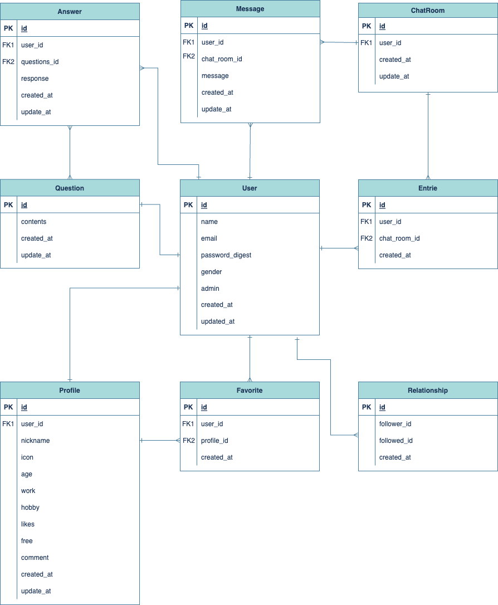
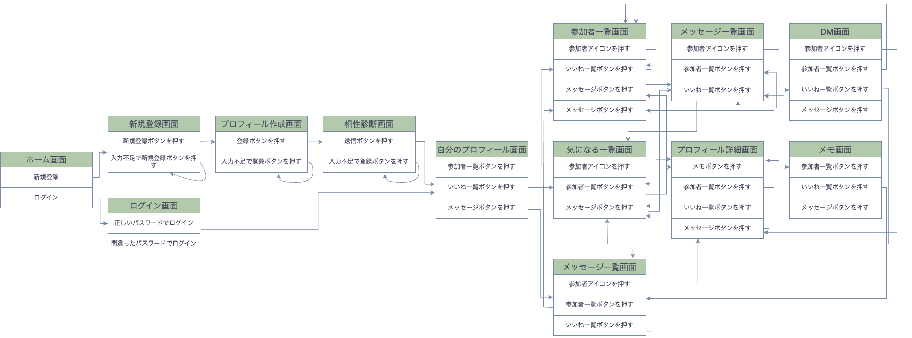

# README

## 開発言語
* ruby 3.0.1
* Rails 6.0.6.1
## 就職Termの技術
* gem devise
* 1対1のメッセージ機能
## カリキュラム外の技術
* Natural Languadge
* gem rails_admin
* gem cancancan
* gem ransack
## 実行手順
```
$ git clone git@github.com:Uchiborii/CONKT.git
$ cd CONKT
$ bundle install
$ yarn install
$ rails db:create
$ rails db:migrate
$ rails s
```
## カタログ設計
https://docs.google.com/spreadsheets/d/1hzKy_m9XlAHrNo-fmcSKu1MItFOqVcAUTCDqECsPcnM/edit#gid=782464957
## テーブル定義書
https://docs.google.com/spreadsheets/d/1hzKy_m9XlAHrNo-fmcSKu1MItFOqVcAUTCDqECsPcnM/edit#gid=2020033787
## ワイヤーフレーム
https://www.figma.com/file/PJ0pX5xCeXPlS7QdCA9I0G/Untitled?type=design&node-id=1%3A2&mode=design&t=A62iMYfZAlTIMcto-1
## ER図

## 画面遷移図
